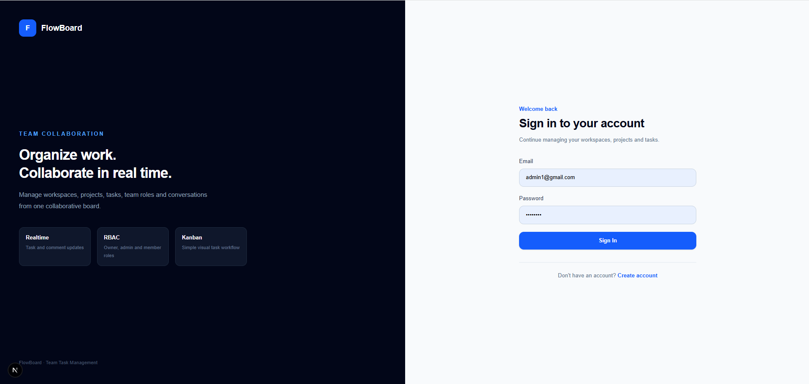
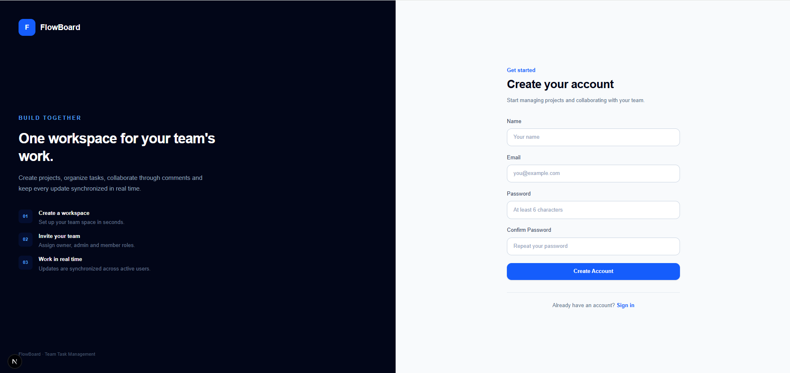
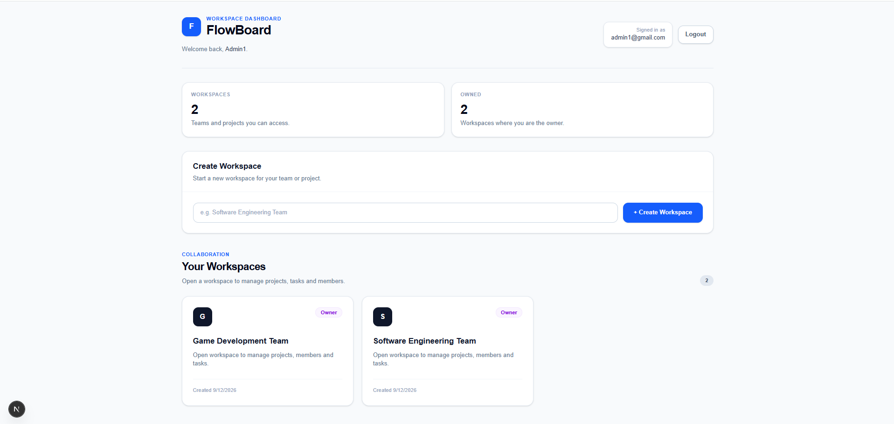
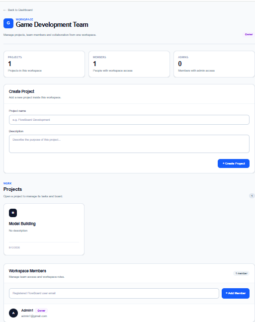
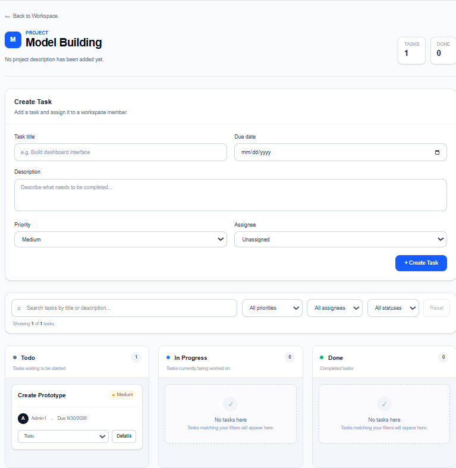
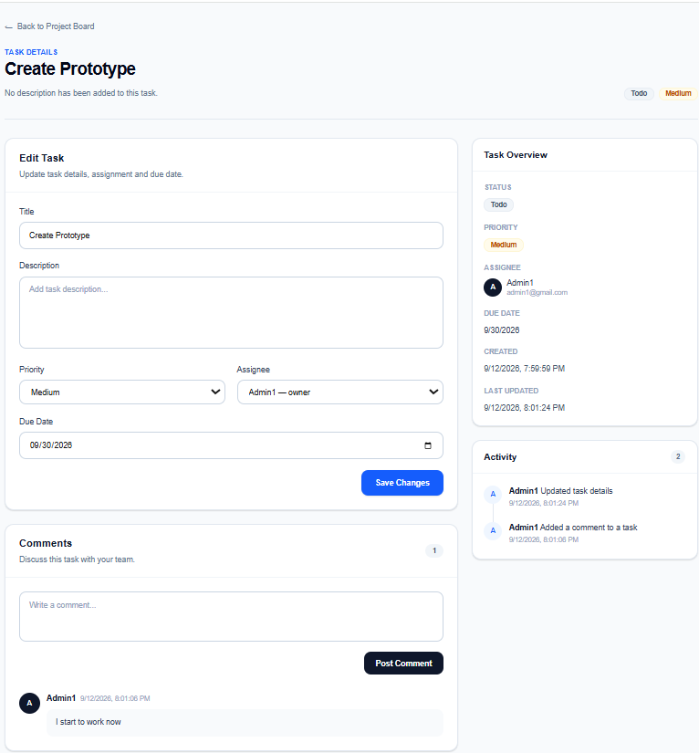

# FlowBoard

FlowBoard is a real-time team task management application built with **Next.js, TypeScript, Tailwind CSS, Supabase, and PostgreSQL**.

It provides teams with a shared workspace for managing projects, assigning tasks, collaborating through comments, managing workspace roles, and receiving real-time updates across multiple users.

---

## Screenshots

### Login



### Register



### Dashboard



### Workspace



### Kanban Board



### Task Details



---

## Features

### Authentication
- User registration and login
- Supabase Authentication
- Automatic user profile creation
- Protected workspace and project access

### Workspace Management
- Create workspaces
- Add registered users by email
- Owner, Admin, and Member roles
- Role-based access control
- Promote members to Admin
- Demote Admins to Member
- Remove members from a workspace

### Project Management
- Create projects inside workspaces
- View projects available to the current workspace
- Workspace-based project access control

### Kanban Task Management
- Todo, In Progress, and Done columns
- Create tasks
- Update task status
- Assign tasks to workspace members
- Set Low, Medium, or High priority
- Add task descriptions
- Set due dates
- Open detailed task pages

### Search and Filtering
- Search tasks by title or description
- Filter by priority
- Filter by assignee
- Filter by status
- Filter unassigned tasks
- Reset active filters

### Task Details
- Edit task title and description
- Update priority
- Reassign workspace members
- Update due dates
- View task metadata
- View comments and workspace activity

### Team Collaboration
- Add task comments
- View activity logs
- Shared workspace member visibility
- Multi-user collaboration

### Real-Time Updates
FlowBoard uses **Supabase Realtime** to synchronize changes across active users.

Real-time updates include:
- Task changes
- Kanban status changes
- Comments
- Activity updates

Changes made by one user can appear for other active users without manually refreshing the page.

---

## Role-Based Access Control

FlowBoard supports three workspace roles.

### Owner
- Create projects
- Add members
- Promote members to Admin
- Demote Admins to Member
- Remove members
- Manage project tasks

### Admin
- Create projects
- Add workspace members
- Manage project tasks

### Member
- Access assigned workspaces
- View projects
- Create and update tasks
- Participate in task discussions

Workspace permissions are enforced using **PostgreSQL Row Level Security** and **Supabase RPC functions**.

---

## Tech Stack

### Frontend
- Next.js
- React
- TypeScript
- Tailwind CSS

### Backend
- Supabase
- PostgreSQL
- Supabase Auth
- Supabase Realtime

### Security
- PostgreSQL Row Level Security
- Security-definer RPC functions
- Workspace membership authorization
- Role-based permission checks

---

## Database Structure

Main tables:

```text
profiles
workspaces
workspace_members
projects
tasks
comments
activity_logs
```

Relationship overview:

```text
User
  |
  +-- Workspace Member
        |
        +-- Workspace
              |
              +-- Project
                    |
                    +-- Task
                          |
                          +-- Comments
```

---

## Application Flow

```text
Register / Login
        |
        v
Dashboard
        |
        v
Workspace
        |
        v
Project
        |
        v
Kanban Board
        |
        v
Task Details
        |
        v
Comments + Activity
```

---

## Local Development

Clone the repository:

```bash
git clone YOUR_REPOSITORY_URL
cd flowboard
```

Install dependencies:

```bash
npm install
```

Create a `.env.local` file in the project root:

```env
NEXT_PUBLIC_SUPABASE_URL=your_supabase_project_url
NEXT_PUBLIC_SUPABASE_PUBLISHABLE_KEY=your_supabase_publishable_key
```

Start the development server:

```bash
npm run dev
```

Open:

```text
http://localhost:3000
```

---

## Production Build

Verify the project before deployment:

```bash
npm run build
```

Run the production server locally:

```bash
npm start
```

---

## Environment Variables

The application requires:

```env
NEXT_PUBLIC_SUPABASE_URL=
NEXT_PUBLIC_SUPABASE_PUBLISHABLE_KEY=
```

Do not commit `.env.local` or other environment files containing project credentials.

---

## Security Notes

FlowBoard uses PostgreSQL Row Level Security to restrict data access based on authenticated workspace membership.

Sensitive backend credentials are not stored in the client application.

The frontend uses only the Supabase publishable key.

---

## Project Purpose

FlowBoard was developed as a software engineering portfolio project to demonstrate:

- Full-stack web development
- Relational database design
- Authentication
- Authorization and RBAC
- PostgreSQL Row Level Security
- Supabase RPC functions
- Real-time applications
- Team collaboration workflows
- Responsive SaaS-style UI design
- Search and filtering
- Multi-user workspace management

---

## Future Improvements

Possible future extensions include:

- Email invitation links
- Drag-and-drop Kanban
- File attachments
- Notifications
- Task labels
- Project analytics
- Workspace settings
- More detailed task-specific audit logs
- Automated tests

---

## Author

Software Engineering Portfolio Project
